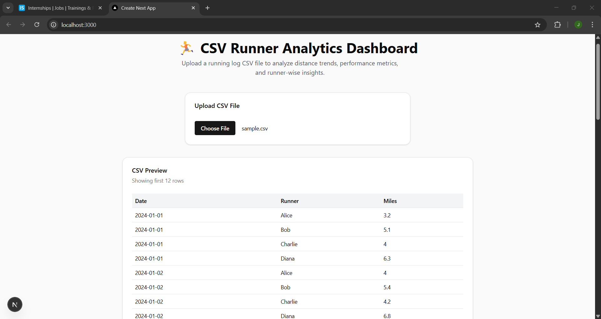
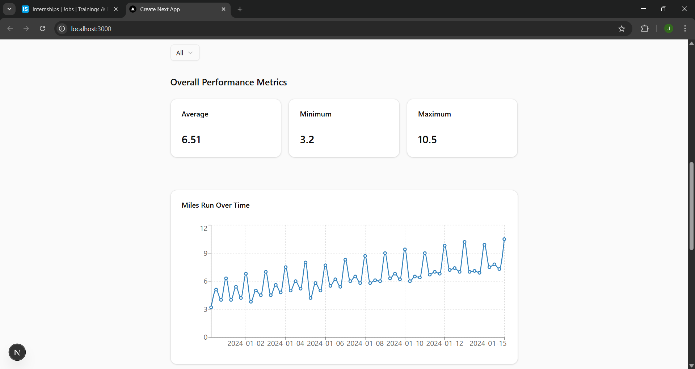
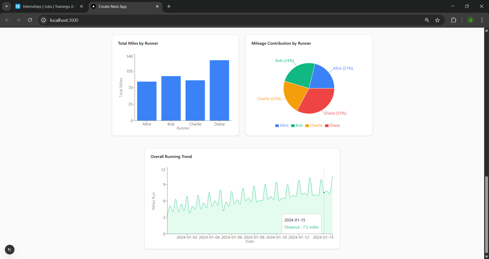

<<<<<<< HEAD
CSV Runner Dashboard : 
Build a dashboard where users can upload a CSV file containing running data and view analytics, metrics, and visualizations.

//What I Built :
1.I developed a CSV Runner Analytics Dashboard using Next.js (App Router) that allows users to:
2.Upload a CSV file with running data
3.Preview uploaded data in a table
4.Filter data by runner
5.View performance metrics (average, minimum, maximum miles)
6.Analyze data using multiple interactive charts
7.The application focuses on data validation, usability, accessibility, and clear data visualization.

//Assumptions :
The following assumptions were made during implementation:
The CSV file must contain exactly these headers:date, person, miles
date is treated as a string and used only for chart labeling (no timezone manipulation).

miles is assumed to be a numeric value (float or integer).

No authentication is required since the challenge focuses on data visualization.

The CSV file is processed entirely client-side for simplicity and speed.

The dashboard supports small to medium CSV files (large enterprise-scale files are out of scope).

//Prerequisites :
Before running the project, ensure you have the following installed:
Node.js: v18.x or higher
npm: v9+
A modern browser (Chrome, Edge, Firefox)
No database or external services are required.

// Setup Instructions
1.Install Dependencies
npm install
2.Environment Variables
This project does not require environment variables.
A .env.example file is not needed because:No authentication,No external APIs,No database connections
3.Sample CSV File
Use this file to test all features.

// Run & Verify
Run the Application- npm run dev
Open your browser and go to: http://localhost:3000

 Step-by-Step Verification (Acceptance Checklist)
✅ Upload CSV
Click Upload CSV
Select a valid CSV file
App validates headers and loads data
✅ CSV Preview Table
Displays first few rows of uploaded CSV
Confirms correct parsing
✅ Metrics
Average miles
Minimum miles
Maximum miles
Metrics update dynamically when filtering by runner
✅ Person Filter
Dropdown to select All or individual runners
All charts and metrics update accordingly
✅ Visualizations
Line chart showing miles over time
Bar chart showing total miles per runner
Area chart showing overall running trend
Pie chart showing mileage contribution by runner
All charts include:
Clear axis labels
Tooltips with units (miles)
Responsive design

//Features & Limitations
//Features
CSV upload and parsing
Header and type validation
CSV preview table
Runner-wise filtering
Overall and per-person metrics
Multiple responsive charts
Clean, modern UI using shadcn/ui
Fully client-side processing

//Limitations

No persistent storage (data resets on refresh)
No CSV export functionality
Very large CSV files may impact performance
No date aggregation (weekly/monthly)
Future Improvements
Weekly/monthly aggregation toggle
Export charts as images or PDF
Dark mode toggle
Support for kilometers ↔ miles conversion
Performance optimization for very large datasets

//Notes on Architecture
Folder Structure
app/
 └── page.tsx        # Main dashboard page
components/
 ├── CsvUploader.tsx
 ├── CsvPreviewTable.tsx
 ├── PersonFilter.tsx
 ├── MetricsCards.tsx
 ├── RunnerChart.tsx
 ├── RunnerBarChart.tsx
 ├── RunnerAreaChart.tsx
 └── RunnerPieChart.tsx
lib/
 └── metrics.ts      # Metric calculations

//Key Components
1.CsvUploader
Handles file upload, parsing, and validation.

2.MetricsCards
Displays calculated metrics using reusable cards.

3.Charts (Recharts)
Modular chart components for maintainability.

//UI & Design

shadcn/ui components for consistency

Responsive layouts using Tailwind CSS

Proper spacing and typography hierarchy

Card-based layout for clarity

Mobile-friendly design

### Dashboard Overview

### Metrics Section

### Charts Section

//Conclusion

This project successfully fulfills the challenge requirements by delivering a clean, accessible, and functional CSV analytics dashboard with clear data insights, professional UI, and extensible architecture.
=======
# csv-runner-dashboard
CSV Runner Analytics Dashboard built with Next.js and shadcn/ui
>>>>>>> 22dc0b95348e44afde70db3f5575b1ec16e2a893
